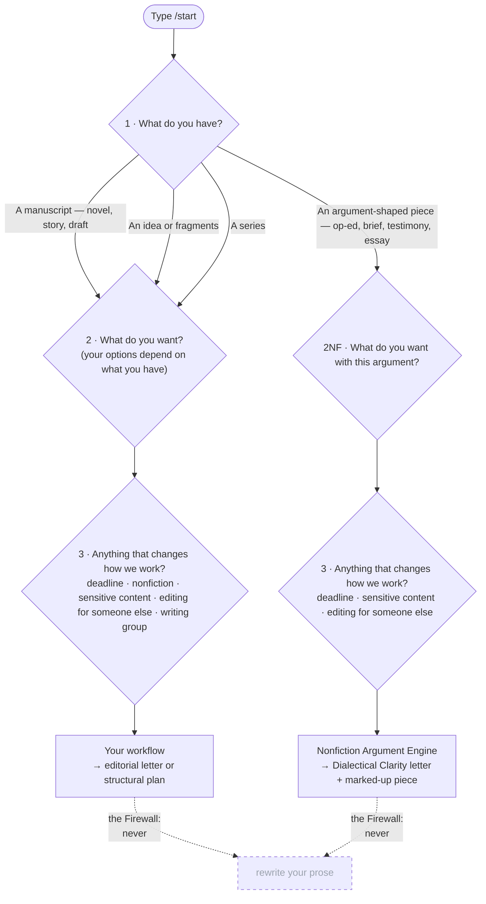

# APODICTIC: anotherpanacea's Development Editor

A development editor for fiction **and** argument-shaped nonfiction. Reads what you wrote, diagnoses structure, never rewrites — stories *or* arguments.



*Every edit starts at `/start`: three plain-language questions — the second's options depend on the first — route you to the right workflow. Nonfiction & argument work is reachable either as an up-front choice or by flagging it at the third question; both land in the Nonfiction Argument Engine. ([Walk the specific routes in the interactive route explorer](https://anotherpanacea-eng.github.io/apodictic/plugins/apodictic/route-explorer.html).)*

## Why This Exists

Every AI writing tool I tried wanted to rewrite my prose. I didn't need a co-writer. I needed what a good developmental editor does — read my manuscript, figure out what it's trying to be, and tell me where it's working and where it isn't. Structurally. Without touching my sentences.

So I built one. Then I kept building — because the same discipline applies to arguments.

## How It Works

**For fiction:** APODICTIC reads a manuscript, predicts its "contract" (genre, reader promise, controlling idea) from the text alone, then measures the work against that contract. When the inferred contract doesn't match what you intended, that's the diagnostic signal — it means the text isn't communicating what you think it is. It runs 11 analytical passes: reverse outline, reader experience mapping, structural diagnosis, character architecture, reveal economy, pacing analysis, and more — all calibrated to your genre. Genre modules adjust what counts as a problem. A slow opening is a feature in literary fiction, a defect in a thriller.

**For argument-shaped nonfiction** (op-eds, policy briefs, testimony, essays): APODICTIC infers the argument contract — the claim you're making, the audience you're addressing, the burden you've accepted, the stakes you've invoked — then measures the piece against it. The engine flags missing warrants, scope drift, and unmet strongest objections via **Dialectical Clarity** and its Red-Team, Persuasion, and Evidence companions. Same Firewall. Same diagnose → letter → marked-up-piece spine. Different front end.

**The Firewall:** APODICTIC diagnoses problems and names *classes* of solution — including which structural elements are missing or mis-weighted. It never drafts your prose, and never scripts the specific content that fills those needs — the events, characters, dialogue, or evidence. Naming that a climax needs a cost paid on the page is diagnosis; writing that scene is yours. You're the writer; it's the analyst.

## See It in Action

You don't have to install anything to see what APODICTIC produces. These open as live, rendered pages:

**Fiction samples:**

- **[A sample editorial letter →](https://anotherpanacea-eng.github.io/apodictic/sample-editorial-letter.html)** — the main deliverable: a structural diagnosis with severity-ranked findings and classes of solution, prose left untouched. ([a second example](https://anotherpanacea-eng.github.io/apodictic/sample-editorial-letter-2.html))
- **[An annotated manuscript →](https://anotherpanacea-eng.github.io/apodictic/sample-annotated-manuscript.html)** — the marked-up copy: each finding anchored in the manuscript where the problem lives, severity-tagged, and cross-linked to the letter. This is the working surface you revise at the line — comments only, never tracked prose changes. (Also exports to Obsidian, and to Word / Google Docs as native anchored comments.)
- **[A targeted audit letter →](https://anotherpanacea-eng.github.io/apodictic/sample-targeted-audit-letter.html)** — a focused single-audit deep dive.
- **[Pre-writing output →](https://anotherpanacea-eng.github.io/apodictic/sample-pre-writing-output.html)** — what you get starting from an idea instead of a draft.

**Nonfiction & argument samples:**

- **[A Dialectical Clarity letter →](https://anotherpanacea-eng.github.io/apodictic/sample-dialectical-clarity-letter.html)** — the argument editorial letter: claim ladder, audience burden, warrant gaps, and the strongest unmet objection, with classes of solution. Never rewrites your argument. (A whole-book development edit of the spine argument in Mark A. R. Kleiman's *When Brute Force Fails*.)
- **Marked-up op-ed** *(forthcoming)* — the argument equivalent of the annotated manuscript: each finding (missing warrant, scope drift, unmet objection) anchored in the piece, severity-tagged, cross-linked to the Dialectical Clarity letter.

Two interactive maps of the tool itself:

- **[Overview dashboard →](https://anotherpanacea-eng.github.io/apodictic/plugins/apodictic/overview-dashboard.html)** — the whole system at a glance: the router, what each pass analyzes, genre modules, audits, and the 50 plot spines.
- **[Route explorer →](https://anotherpanacea-eng.github.io/apodictic/plugins/apodictic/route-explorer.html)** — answer the same three questions `/start` asks and watch where it routes you.

*(Tip: these are rendered links. Opening the raw `.html` files directly in the GitHub file browser shows source code, not the page.)*

## Beyond Full Edits

APODICTIC isn't just for finished drafts. Both pillars — fiction and argument-shaped nonfiction — share the same diagnostic spine.

### Fiction

- **Partial manuscript diagnostic** — stuck mid-draft? APODICTIC runs on what exists without penalizing missing structure. Adds momentum tracking, stall detection, and a setup inventory showing what your draft has committed to. Synthesis focuses on what's working, what's stalling, and where to go next
- **Fragment synthesis** — scattered scenes and notes but no continuous narrative? Fragment Synthesis clusters your material, maps connections, and produces a candidate structure showing what your fragments add up to
- **Revision Coach** (`/coach`) — post-diagnostic coaching that helps you plan revision sessions without doing the revision for you. Four modes: session planning (leverage-ranked priorities matched to your available time), stuck-point coaching (8-type block diagnosis with structurally-informed writing experiments), momentum tracking (session-over-session progress), and deadline coaching (honest triage with revision calendar). Includes 7 structural prompt families, a stuck-point exercise library, nocebo inoculation, and no-prompt zones for states where more structure would make things worse
- **Series Continuity** (`/audit series-continuity`) — cross-volume consequence tracking for multi-book series. Five diagnostic channels: character state, world rules, unresolved threads, hope calibration, and intentional discontinuities. Rolling `Series_State.md` persists across volumes
- **Pre-writing pathway** for writers who have an idea but no manuscript — takes you from seed to draftable structure
- **Plot coach** with 50 structural spines across 12 families (not just three-act)
- **37 available audits** (3 universal, 19 craft, 10 genre, 5 tag) including scene function, shelf positioning, emotional craft, AI-prose detection, worldbuilding integration, force architecture, reception risk, and intimacy/consent coverage
- **Genre calibration** across literary fiction, horror, mystery, thriller, SF/F, romance, and hybrids

### Nonfiction & Argument

- **Nonfiction Argument Engine** — for persuasive, argument-shaped nonfiction (policy briefs, op-eds, testimony, essays). Infers the argument contract (claim, audience, burden, stakes) from the text, then diagnoses where the argument breaks down: missing warrants, scope drift, unmet strongest objections. Produces an argument editorial letter and a marked-up piece with anchored findings
- **Dialectical Clarity** (`/audit dialectical`) — deep-dive argument structure audit: thesis–antithesis balance, claim ladder, rhetorical fairness, straw-position detection
- **Red-Team, Persuasion, and Evidence companions** — three focused argument companions that stress-test the argument against its strongest opposition (Red Team), audit audience fit and rhetorical force (Persuasion), and verify the evidence base under the claim ladder (Evidence)
- **Argument coaching** — revision coaching for arguments, with the same session-planning and stuck-point modes as the fiction coach, calibrated to argument structure
- **Citation Verification and Field Reconnaissance** research modes — internet-enabled verification of sources and scouting for counterevidence and literature gaps; especially valuable for argument-shaped nonfiction
- **Nonfiction pre-draft** — for writers who have an argument but not yet a draft, coming to the same pre-writing pathway with argument-contract framing

**Shared across both pillars:**

- **6 internet-enabled research modes** for citation verification, comp validation, fact-checking, field reconnaissance (counterevidence + literature gaps), genre currency, and representation context
- **Legal Risk Register** (`/legal-risk`) — flags possible defamation, privacy, and rights exposure for a lawyer's review. It flags, never adjudicates — not legal advice
- **Feedback triage and beta-reader instrument** (`/triage-feedback`, `/reader-questions`) — sort and prioritize beta-reader/editor feedback, and turn a diagnosis into targeted reader questions
- **Project addressability** (`/projects`) — list, resume, and tidy editing projects from saved diagnostic state, with Retcon Planning and State Cards
- **Manuscript-structure visualizations** plus **Diagnostic-Vocabulary** and **Editor-Scaffolding** operator modes

## Install

APODICTIC works best on strong frontier models with enough context for large-manuscript analysis. 

### Which install do I need?

Pick the row for the app you'll actually run APODICTIC in — that's the only thing that decides your path:

| You're using… | Go to | Fastest path |
|---|---|---|
| **Antigravity** | [Antigravity (Native)](#antigravity-native) | Workspace Isolation — download the zip, open the folder, `/start` |
| **Codex** | [Codex](#codex) | Download the zip, open the `codex/` folder, install from the local marketplace |
| **Claude Code (CLI / terminal)** | [Claude Code (CLI)](#claude-code-cli) | Two `/plugin` commands |
| **Cowork (desktop app)** | [Cowork (Desktop App)](#cowork-desktop-app) | Add the marketplace from GitHub, then install |

Whichever path you take, it ends the same way: start a fresh session and type `/start`.

### Antigravity (Native)

APODICTIC supports two modes of execution in Antigravity: Workspace Isolation (recommended) and Global Installation.

#### Method 1: Workspace Isolation (Recommended)
This method keeps APODICTIC isolated to its own project context, safely containing manuscript analysis.

1. Download **`apodictic-antigravity.zip`** from the [latest release](https://github.com/anotherpanacea-eng/apodictic/releases/latest) and unzip it. (No clone or build step — the workspace is prebuilt.)
2. Open the unzipped `antigravity/` folder as your **workspace root**.
3. Start a fresh thread and type `/start`.

Prefer to build from source? Clone the repo, run `node scripts/build-antigravity.mjs`, and open the generated `antigravity/` folder instead.

#### Method 2: Global Installation
If you want APODICTIC available globally across all of your Antigravity workspaces.

1. Download and unzip **`apodictic-antigravity.zip`** from the [latest release](https://github.com/anotherpanacea-eng/apodictic/releases/latest) (or clone the repo and run `node scripts/build-antigravity.mjs`).

2. Symlink the generated plugin into your global Antigravity data directory:

```bash
mkdir -p ~/.gemini/antigravity/plugins
ln -s "$(pwd)/antigravity/plugins/apodictic" ~/.gemini/antigravity/plugins/apodictic
```

3. Copy the workflow definitions into the `.agents/workflows` directory of whatever active workspace you want to run APODICTIC from:

```bash
cp -r antigravity/.agents/workflows/* /path/to/your/workspace/.agents/workflows/
```
4. Start a fresh thread and type `/start`.

### Codex

1. Download **`apodictic-codex-marketplace.zip`** from the [latest release](https://github.com/anotherpanacea-eng/apodictic/releases/latest) and unzip it. (No clone or build step — the workspace is prebuilt.)
2. Open the unzipped `codex/` folder as your Codex workspace root.
3. In Codex, open the Plugins view and install `APODICTIC` from the local marketplace.
4. Start a fresh thread and run `apodictic-start`.

If APODICTIC does not appear, the usual cause is opening the wrong folder. Codex must be opened on the generated `codex/` directory, not the repo root.

Prefer to build from source? Clone the repo, run `node scripts/build-codex.mjs`, and open the generated `codex/` folder instead.

### Claude Code & Cowork

APODICTIC also installs into Claude Code and Cowork through the plugin marketplace — pick your host below.

### Claude Code (CLI)

```
/plugin marketplace add anotherpanacea-eng/apodictic
/plugin install apodictic@anotherpanacea-eng-apodictic
```

### Cowork (Desktop App)

Go to **Customize > Browse > Personal > +** and select **Add marketplace from GitHub**. Enter `anotherpanacea-eng/apodictic`, then install the plugin.

Or download `apodictic.plugin` from the [latest release](https://github.com/anotherpanacea-eng/apodictic/releases/latest) and upload it through Cowork. (Mac users: if your browser auto-unzips the download, re-zip the folder and rename it to `apodictic.plugin`.)

### Updating to a new version

```bash
claude plugin marketplace update apodictic
```

Or `/plugin marketplace update apodictic` from inside Claude Code (CLI). For Cowork Desktop, use the marketplace's update control in the Customize panel.

**Then fully quit and relaunch Claude Code / Cowork** — a restart is required to apply the new version. The marketplace cache will refresh on update, but the running process keeps the previous version loaded until relaunched.

---

## Your First Five Minutes

1. **Install** APODICTIC for your host (see above), then start a fresh session.
2. **Type `/start`.** It asks three plain-language questions — what you have (an idea, fragments, a partial draft, a complete draft, or a series), what you want, and anything that should change how it works.
3. **Give it your manuscript** when it asks — paste it, or point it at the file.
4. **Read the editorial letter.** You get a structural diagnosis like the [samples above](#see-it-in-action): what's working, what isn't, ranked by severity, each with a class of solution. It never rewrites your prose.
5. **Decide what's next.** The letter ends by pointing you onward — a focused `/audit`, revision planning with `/coach`, or a submission-readiness check with `/ready`.

Not sure where to begin? Just `/start`. When in doubt, that's the front door.

## Commands

**Start here:**
- `/start` — I have a manuscript or argument — what should I do with it?
- `/apodictic` — What can this plugin do? Where do I start?

**Diagnostic workflows:**
- `/ready` — Is this ready to submit?

**Focused tools:**
- `/audit` — Run a specific deep-dive analysis — including argument audits (dialectical, argument-decision).
- `/research` — I need internet-assisted verification.
- `/coach` — I have a diagnosis — how do I revise?
- `/plot-coach` — Is my plot structure working?
- `/legal-risk` — Flag legal exposure (defamation, privacy, rights) for a lawyer's review.
- `/world-bible` — Check my worldbuilding bible for self-contradiction (rules, magic costs, geography/timeline).
- `/triage-feedback` — Sort and prioritize beta-reader / editor feedback.
- `/reader-questions` — Turn my diagnosis into targeted beta-reader questions.

**Setup:**
- `/pre-writing` — I have an idea but no manuscript yet.
- `/new-project` — Set up a new editing project.
- `/projects` — List, resume, and tidy my editing projects.

## Key Terms

A few words you'll meet in the README and in your first editorial letter:

**Fiction terms:**

- **Contract** — what APODICTIC infers your manuscript is *trying to be*: its genre, the promise it makes to readers, and its controlling idea. It predicts this from the text alone, then measures the book against it. When the inferred contract doesn't match what you intended, that mismatch is the core diagnostic signal.
- **Controlling idea** — the central meaning or argument the story makes through its events. Part of the contract.
- **The Firewall** — APODICTIC diagnoses structure and names *classes* of solution (what category of fix the problem needs, and which structural elements are missing or mis-weighted), but never drafts your prose or scripts the specific content that fills them — the events, characters, dialogue, or evidence. Naming a needed element is diagnosis; inventing what fills it is yours. You're the writer; it's the analyst. Applies equally to fiction and argument-shaped nonfiction.
- **Pass** — one analytical lens over the manuscript (reverse outline, reader experience, reveal economy, and so on). A development edit runs the passes your question requires.
- **Macro block** — a group of passes organized around a writer question (e.g. "Structure Map," "Reader Dynamics"). Eight blocks in all.
- **Audit** — a specialized deep-dive beyond the core passes (genre, craft, or tag), run via `/audit`.
- **Genre module** — recalibrates what counts as a problem for your genre. A slow opening is a feature in literary fiction, a defect in a thriller.
- **Editorial letter** — the main deliverable: a structural diagnosis with severity-ranked findings, each paired with a class of solution.
- **Severity tiers** — every finding is ranked **Must-Fix**, **Should-Fix**, or **Could-Fix**. Severity is locked before any charity reframing, so it can't be quietly softened (the "Deficit Lock").
- **Spine** — a plot-structure paradigm (Hero's Journey, Mystery, Spiral, …). APODICTIC works with 50 spines across 12 families, not just three-act.
- **Reverse outline** — reconstructing what each scene *actually* does, as opposed to what you intended — the starting point for structural diagnosis.

**Argument terms** (for nonfiction & argument-shaped work):

- **Argument contract** — the nonfiction equivalent of the fiction contract: the claim you're making, the audience you're addressing, the burden of proof you've accepted, and the stakes you've invoked. APODICTIC infers this from the text and measures the piece against it.
- **Claim ladder** — the hierarchy of claims in an argument: the core thesis at the top, supporting sub-claims below it, and the evidence tiers beneath those. Dialectical Clarity maps this structure and flags where rungs are missing or unsupported.
- **Warrant** — the logical connector between a claim and its evidence. A missing warrant is the most common structural failure in argument-shaped nonfiction — the evidence is there, but the link to the claim is implicit, absent, or broken.
- **Burden** — what you've committed to proving by making your central claim. If the claim is strong, the burden is high; if the piece doesn't meet it, that's the core diagnostic finding.
- **Dialectical Clarity** — APODICTIC's argument audit: maps the claim ladder, identifies missing warrants, checks rhetorical fairness (does the piece engage the strongest version of the opposition?), and flags scope drift.
- **Scope drift** — when the argument quietly shifts its claim partway through, so the evidence at the end is supporting a different (usually weaker) claim than the one the piece opened with.

## Project Docs

- [ROADMAP.md](ROADMAP.md) — what's planned after publication
- [BIBLIOGRAPHY.md](BIBLIOGRAPHY.md) — sources and influences (~155 works cited)
- [CONTRIBUTING.md](CONTRIBUTING.md) — how to contribute, changelog policy
- [CODE_OF_CONDUCT.md](CODE_OF_CONDUCT.md)

## License

This work is licensed under [CC BY-NC-SA 4.0](https://creativecommons.org/licenses/by-nc-sa/4.0/).

You can use, adapt, and share this framework for non-commercial purposes, with attribution and under the same license.

## Author

Joshua A. Miller, PhD
